# Tableau Server OpenID Connect Configuration for AWS Cognito

AWS Cognito can be an OpenID Connect (OIDC) provider for Tableau Server. Cognito will need a User Pool to be configured and an Application in that User Pool can be configured to support an OIDC Authorization Code Flow. In terms of the OIDC standard, Tableau is the Relying Party and can be considered a confidential client.

## Basic Setup for AWS Cognito as the Identity Provider

On the Tableau Services Manager (TSM) Configuration tab, you will need to enter some OIDC settings that are configured on the Cognito application.

These will include:

1. Provider Client ID
2. Provider client secret
3. Provider configuration URL (.well-known/openid-configuration)


On the Cognito application side, you will configure the Tableau redirect endpoint (aka redirect uri in the standard) defined in Step 3 of the Tableau configuration. Note that this is based on the External URL for Tableau which could be a load balancer or Reverse Proxy DNS name. You will need to configure TLS/HTTPS for Tableau Server as a prerequisite. 

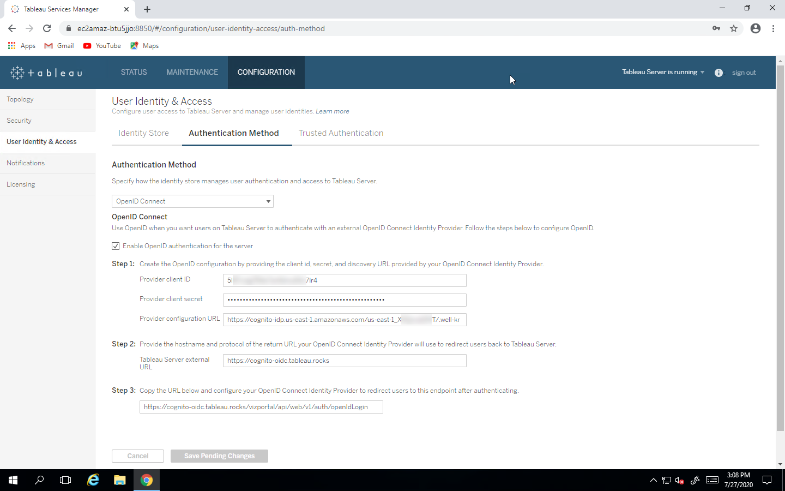

On the Cognito side, you will create a User Pool and an Application Integration

The User Pool:

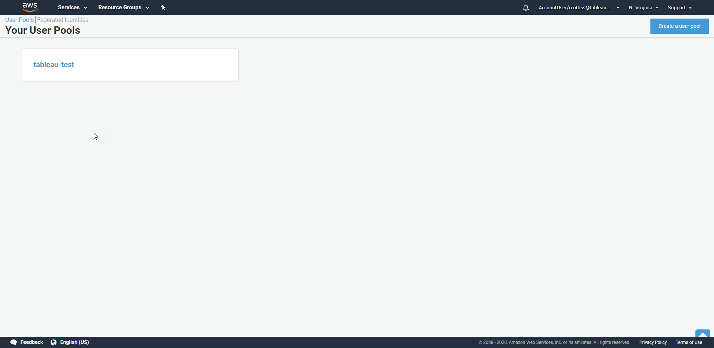

I have a User Pool called tableau-test. **Note the Pool Id.** Also, at the User Pool level you define user attributes. We will need at least one attribute to use as the Tableau Username. Usually this will be email but we should be able to support any unique attribute that can be sent in the OIDC token.

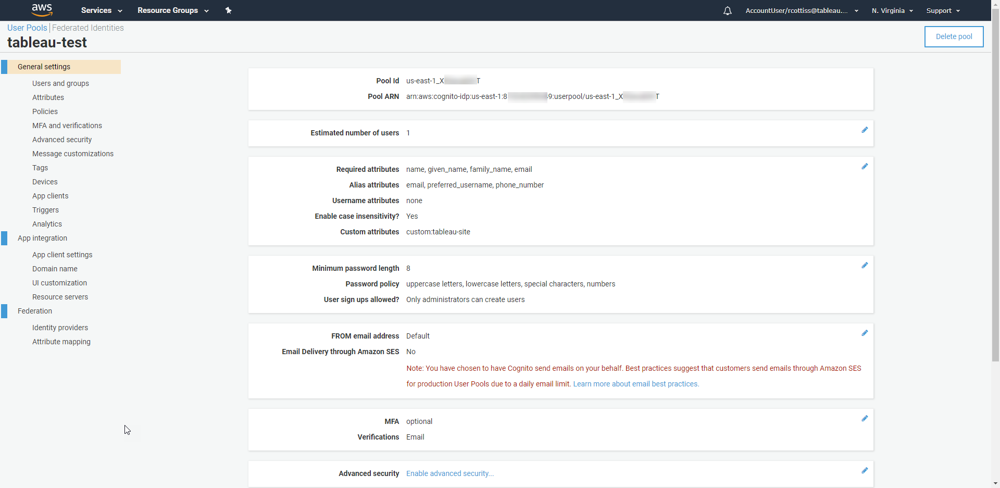

The pool has one user so far:

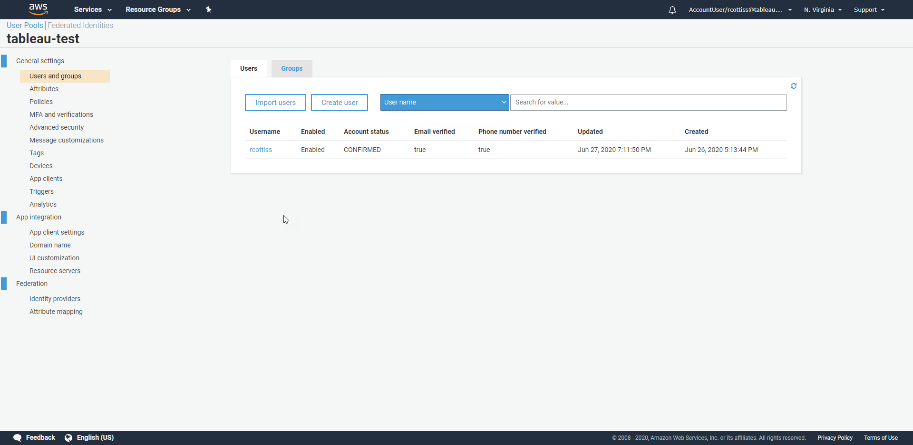

You can also create Groups (These would be used for provisioning users to Tableau):

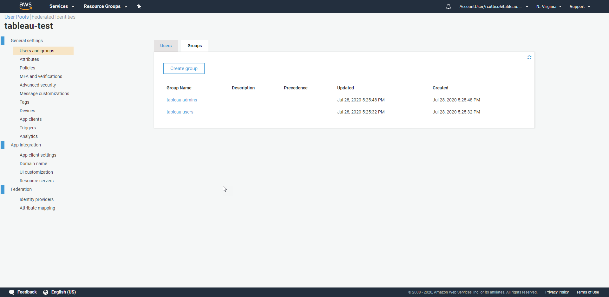

We need an Application Client. This is where we define and find the OIDC settings that Tableau requires. 

Note the App client ID. This is the Provider client ID you will enter into the Tableau Server User & Identity Authentication settings page. The Client Secret is provided to you when you create the app integration. This page does not show the Provider Configuration URL but you can construct using the following rule: [https://cognito-idp.<region>.amazonaws.com/<userpoolid>/.well-known/openid-configuration](https://cognito-idp.us-east-1.amazonaws.com/us-east-1_X9QwubDKT/.well-known/openid-configuration). 

In my case, the URL is: [https://cognito-idp.us-east-1.amazonaws.com/us-east-1_X...T/.well-known/openid-configuration](https://cognito-idp.us-east-1.amazonaws.com/us-east-1_X9QwubDKT/.well-known/openid-configuration). You can paste this into a browser and get back the metadata: 


```
{
   "authorization_endpoint":"https://auth.tableau.rocks/oauth2/authorize",
   "id_token_signing_alg_values_supported":[
      "RS256"
   ],
   "issuer":"https://cognito-idp.us-east-1.amazonaws.com/us-east-1_X...T",
   "jwks_uri":"https://cognito-idp.us-east-1.amazonaws.com/us-east-1_X...T/.well-known/jwks.json",
   "response_types_supported":[
      "code",
      "token"
   ],
   "scopes_supported":[
      "openid",
      "email",
      "phone",
      "profile"
   ],
   "subject_types_supported":[
      "public"
   ],
   "token_endpoint":"https://auth.tableau.rocks/oauth2/token",
   "token_endpoint_auth_methods_supported":[
      "client_secret_basic",
      "client_secret_post"
   ],
   "userinfo_endpoint":"https://auth.tableau.rocks/oauth2/userInfo"}

```

The callback URL here is the URL from **Step 3**. You will need to check Authorization code grant. and email, openid and profile as the Allowed OAuth Scopes (not sure if all are mandatory but openid is needed as that is the scope that actually enables the OIDC authentication flow).  

Depending on how you are creating the user interface for authentication you may need a Hosted UI.

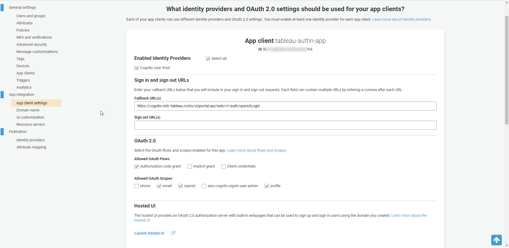

You probably will have a custom domain for the App integration.

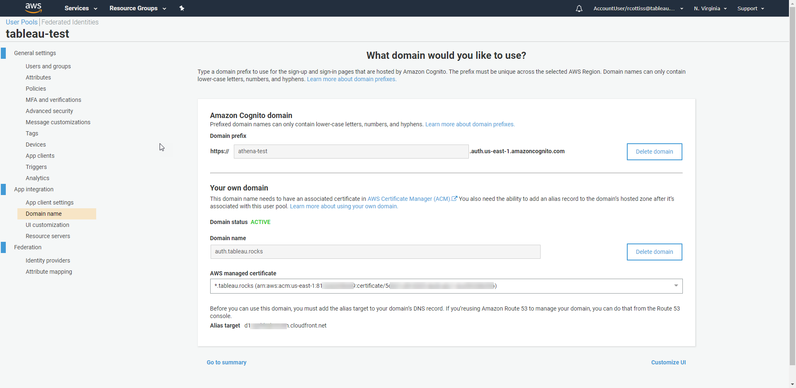

## Setup for Federated Identity Providers

Cognito allows external federated Identity Providers. As of August 2020, the list of supported providers includes:


* Facebook
* Google
* Amazon
* Apple
* OpenID Connect
* SAML

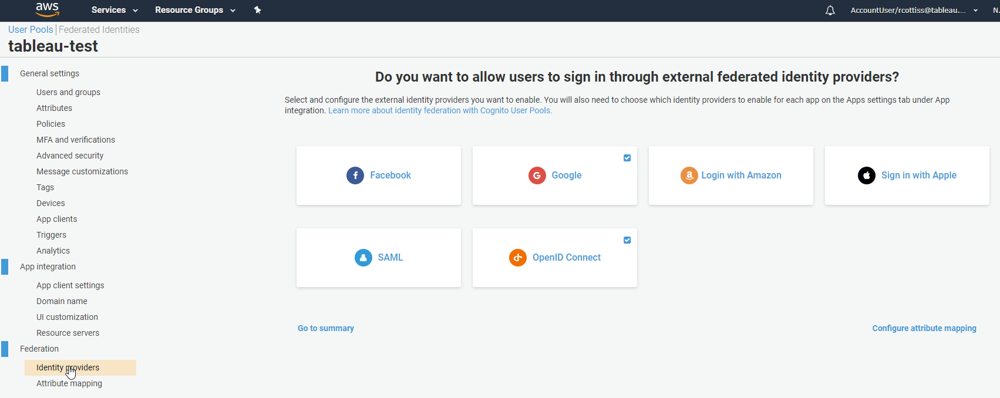

OpenID Connect (OIDC) and SAML are general external providers which allow for a large range of providers to be configured. It is possible to add multiple SAML and multiple OIDC providers to a single Cognito User Pool but it is important to understand that a single user can only authenticate to Tableau using one and only one of the configured providers. For details see the section on mixing providers later in this document.

We will configure Google and Okta OIDC as examples.

### Google

Once the User Pool and Tableau App Client is configured as an OIDC provider adding Google is mostly a matter of following the AWS instructions, configuring the right attribute mapping for the Tableau username and enabling Google in the the App Client. The relevant AWS docs are here: http://docs.aws.amazon.com/cognito/latest/developerguide/cognito-user-pools-identity-federation.html

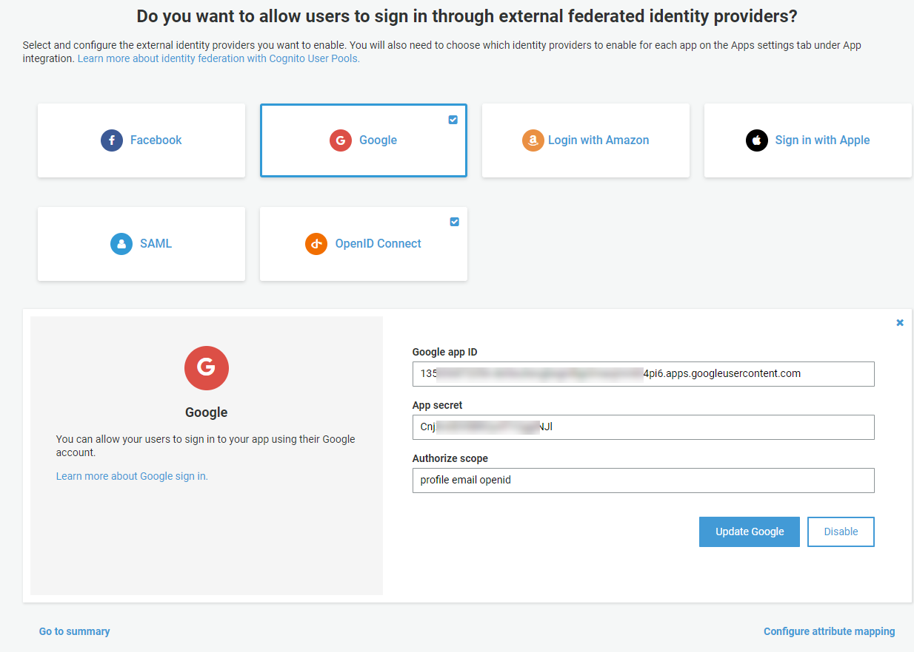

Here are the mapped attributes for my Google provider, The important one is email as that is what will hold the Tableau Username Attribute for the first authentication.

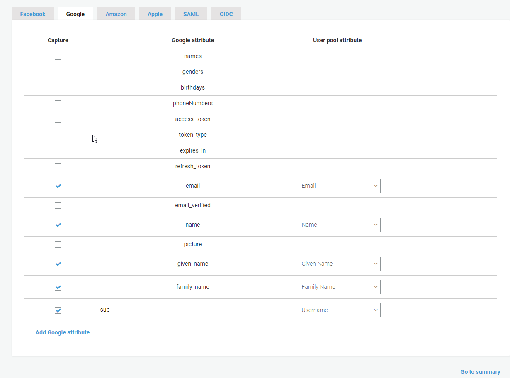

If the user does not already exist in Cognito that user will be created automatically in Cognito at the time of authentication.  I created a user in Google Cloud Identity with an email of cognito1@tableau.rocks.

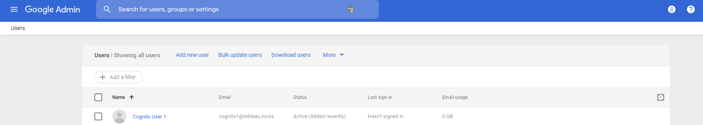

When I authenticated via Cognito using the Google Sign-in button:

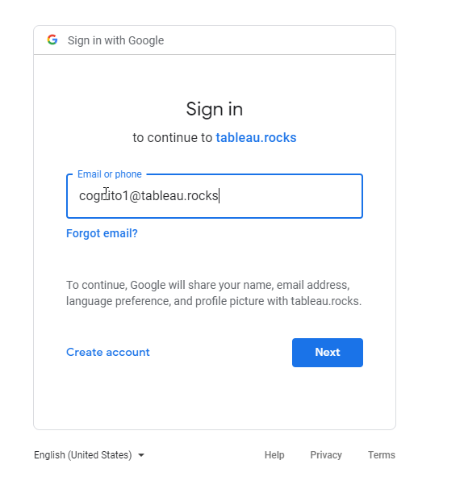

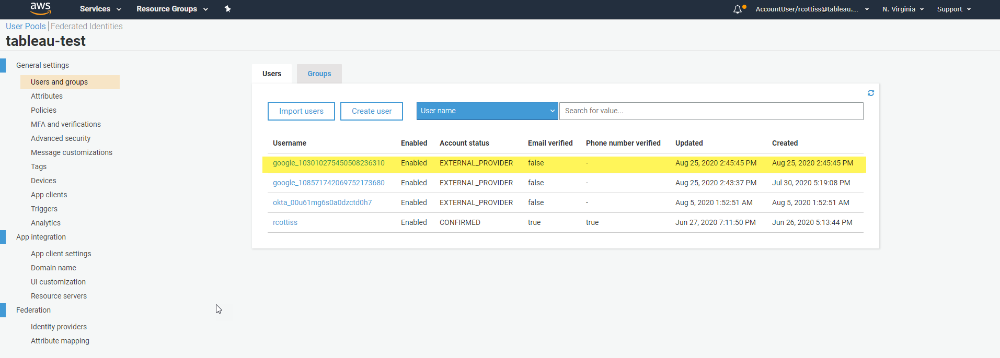

The user is created dynamically in Cognito and the Google attributes are mapped to Cognito attributes:

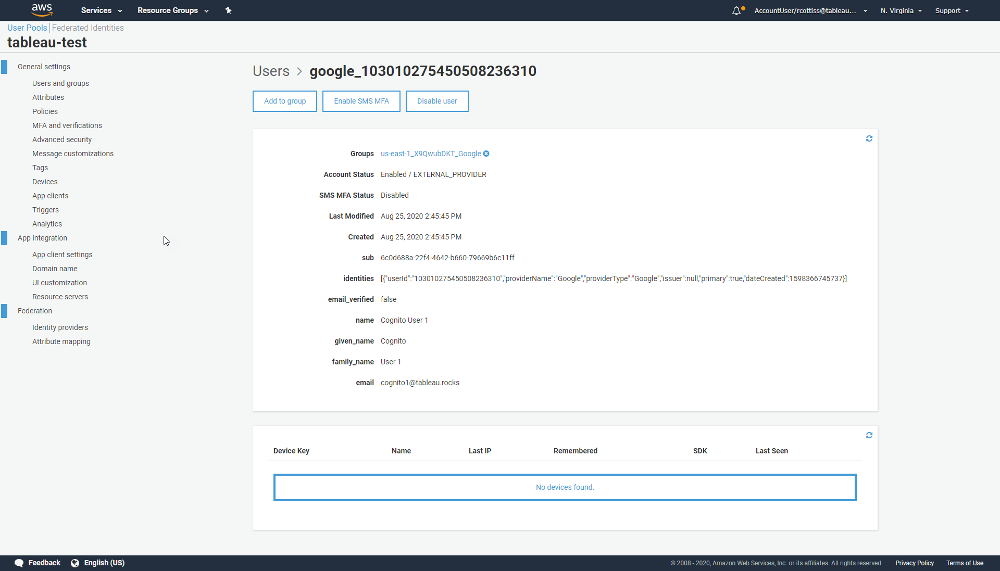

Note that I did need to create the user ahead of time in Tableau because we have not covered how to dynamically provision users in Tableau. Just-in-Time provisioning can be achieved with the Tableau REST API but will not be covered in this document.

### Okta OIDC

AWS Documentation: https://docs.aws.amazon.com/cognito/latest/developerguide/cognito-user-pools-identity-provider.html#cognito-user-pools-oidc-providers

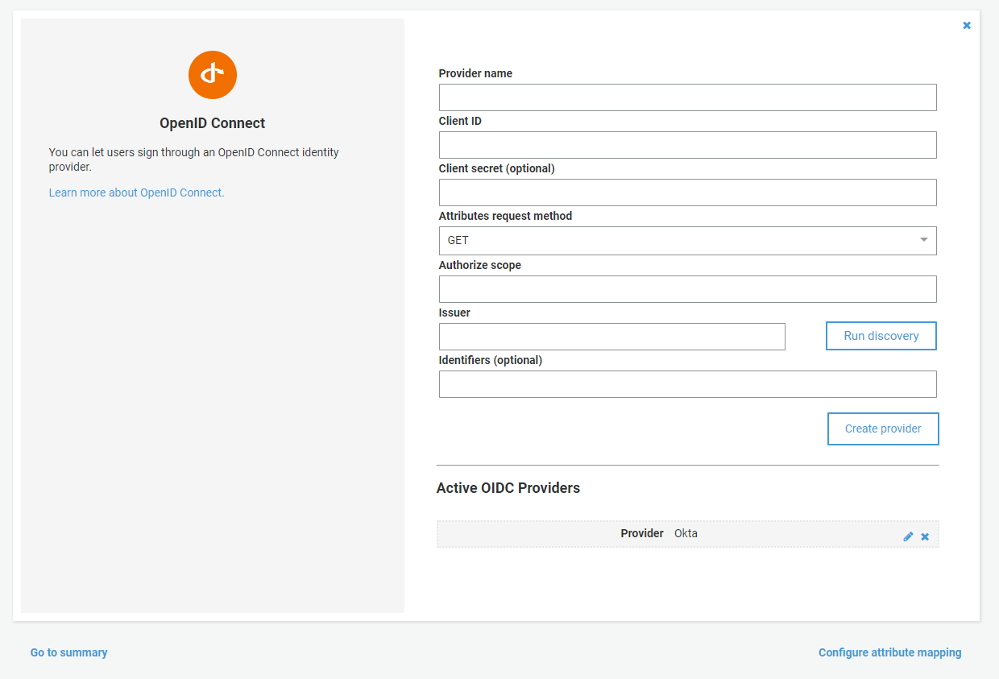
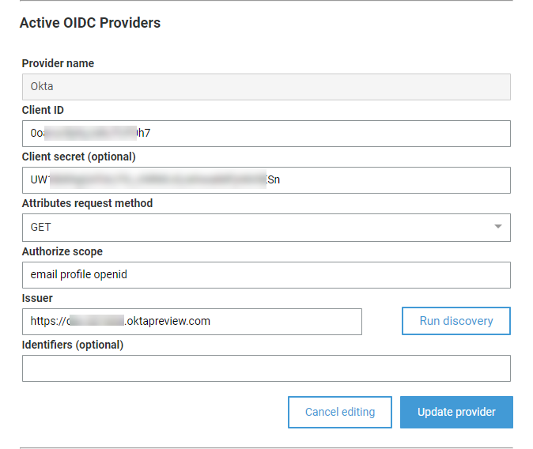

Here are the mapped attributes for my Okta OIDC provider, The important one is email as that is what will hold the Tableau Username Attribute for the first authentication. See the later discussion about the **Sub** attribute, It cannot be changes and has some implications about how the different providers can be mixed.

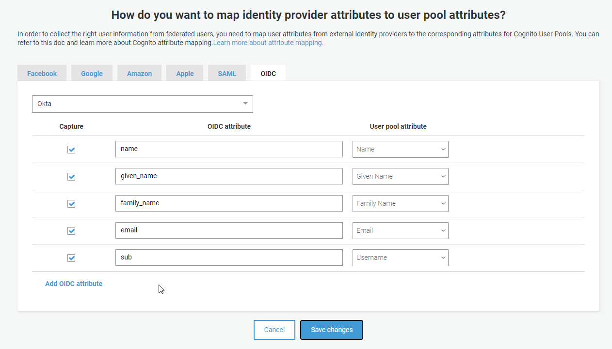

## Adding Federated Providers to Client App Configuration

 

## Discussion about mixing providers

